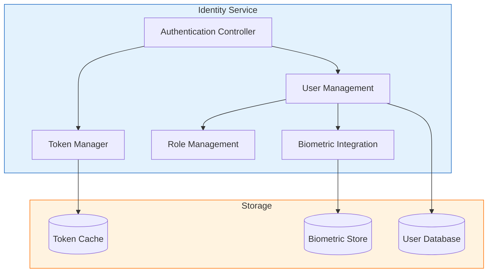
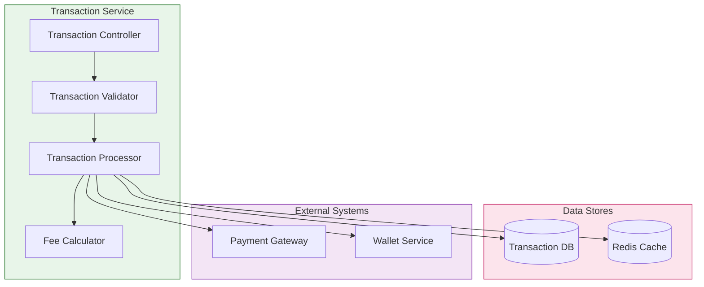
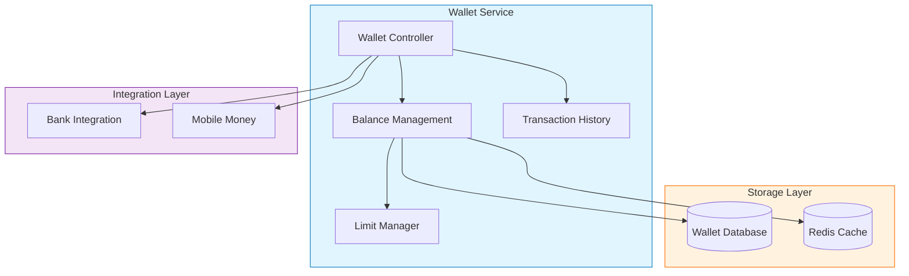
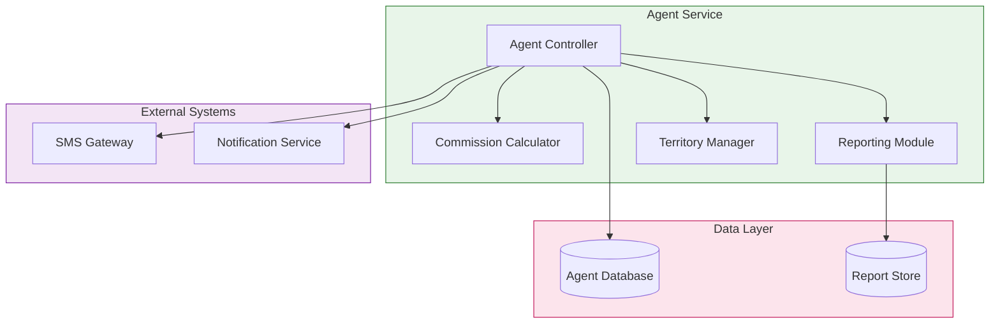
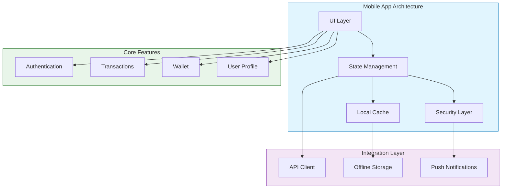
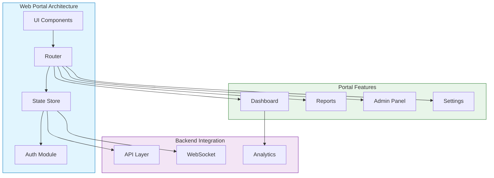

# Component Architecture

## Identity Service Architecture

## Transaction Service Architecture

## Wallet Service Architecture

## Agent Service Architecture

## Mobile App Architecture

## Web Portal Architecture

