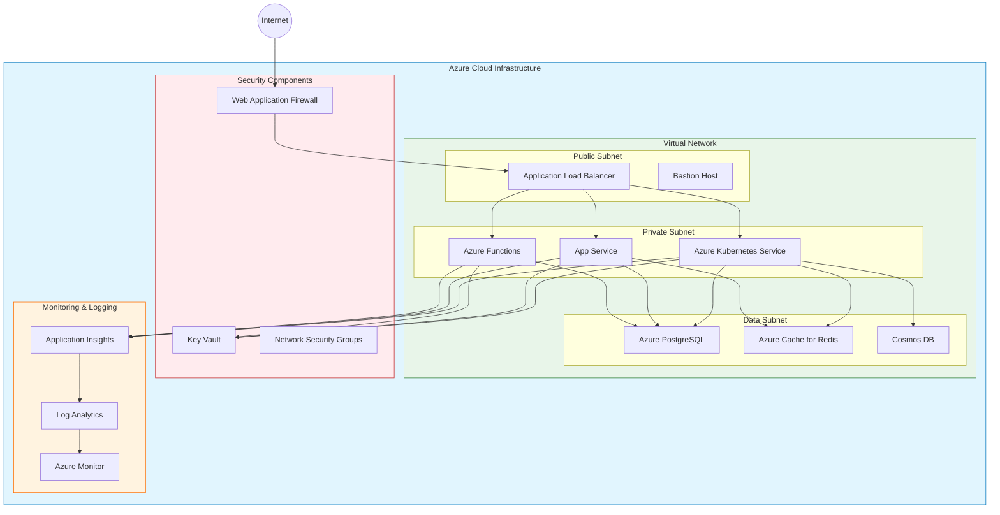
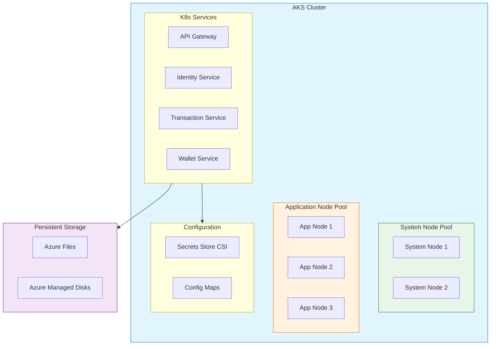
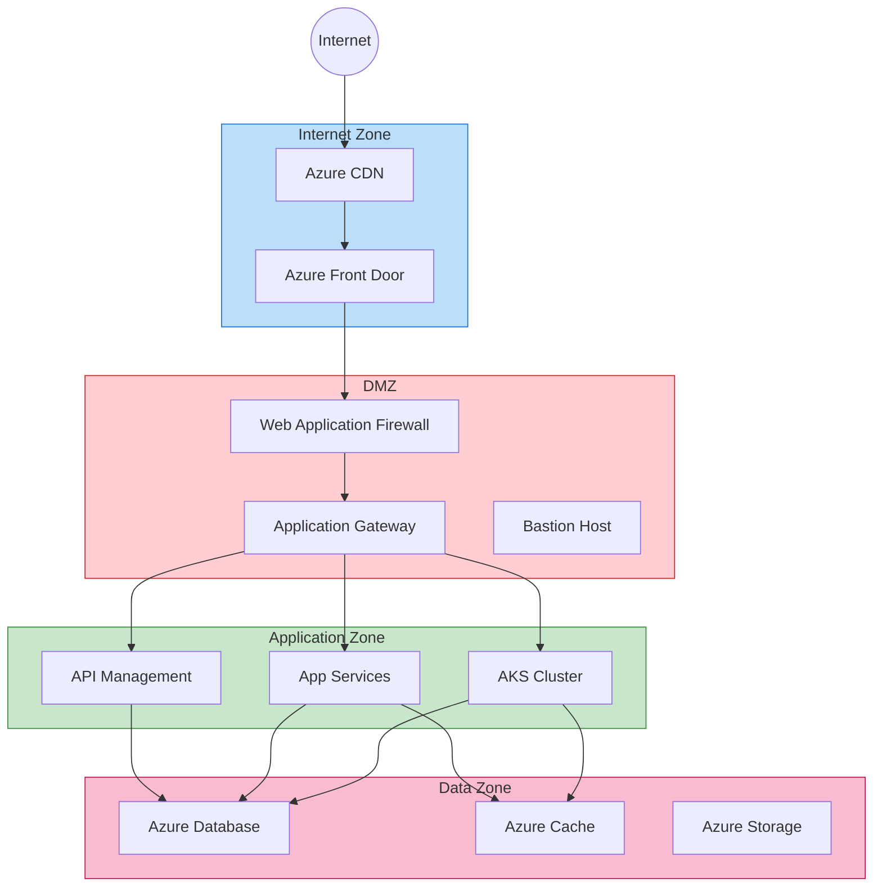
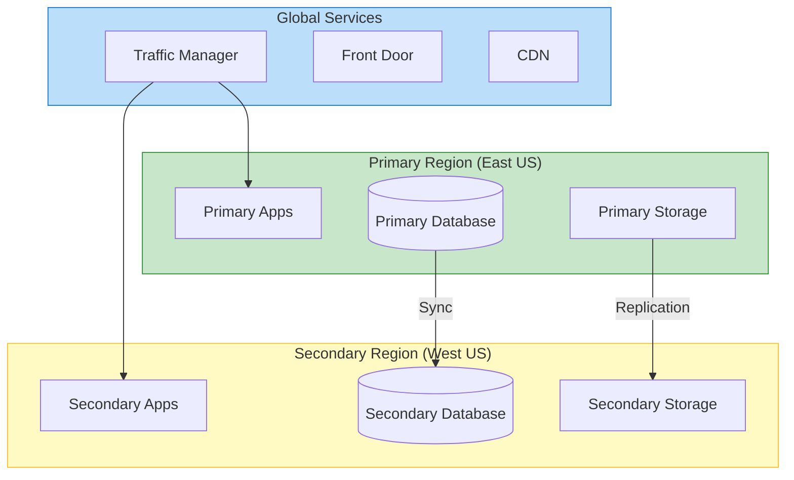
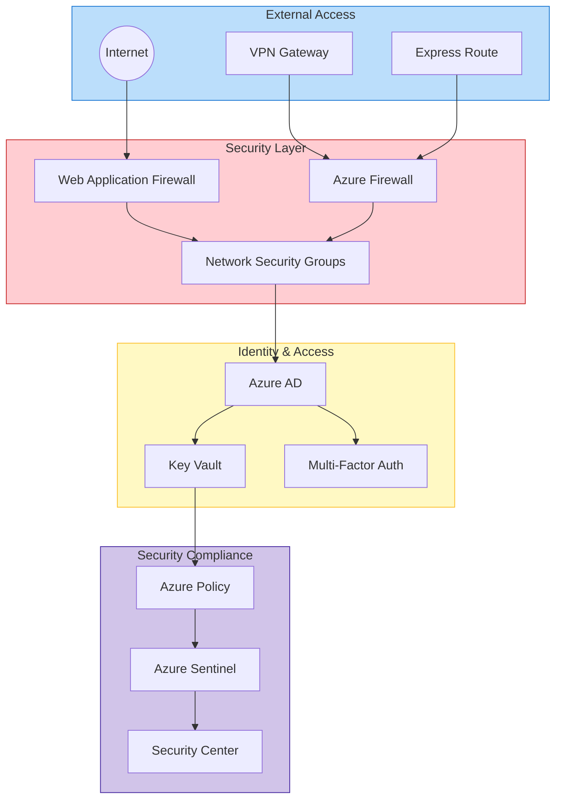
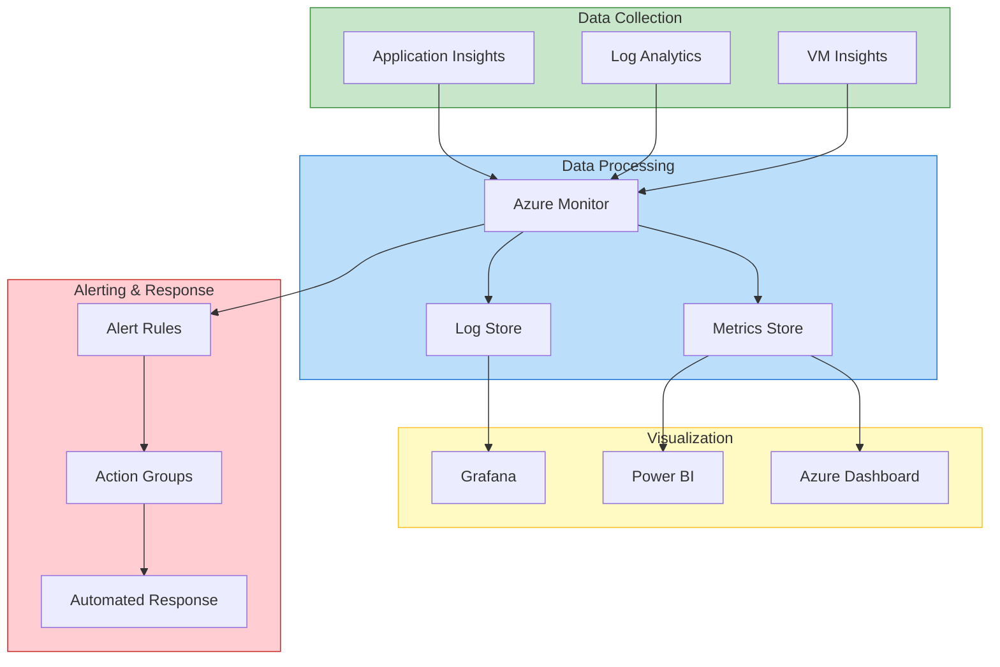
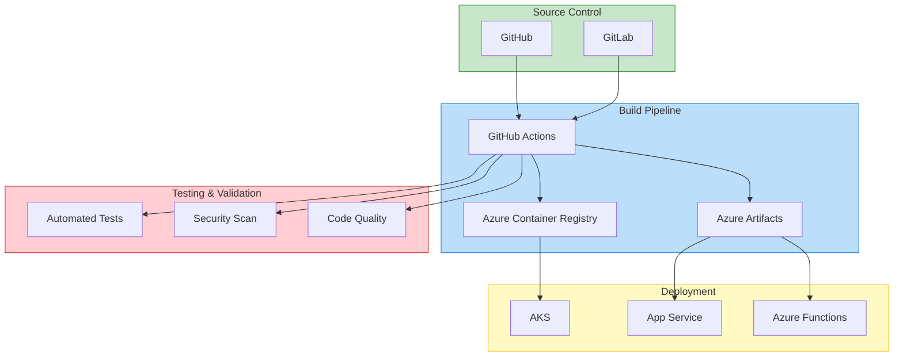

# Infrastructure Architecture

## Cloud Infrastructure Overview

## Kubernetes Infrastructure

## Network Architecture

## Disaster Recovery Setup

## Security Infrastructure

## Monitoring Infrastructure

## CI/CD Infrastructure

