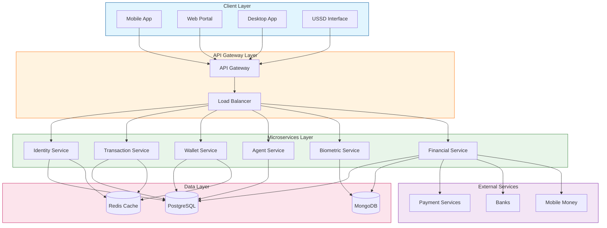
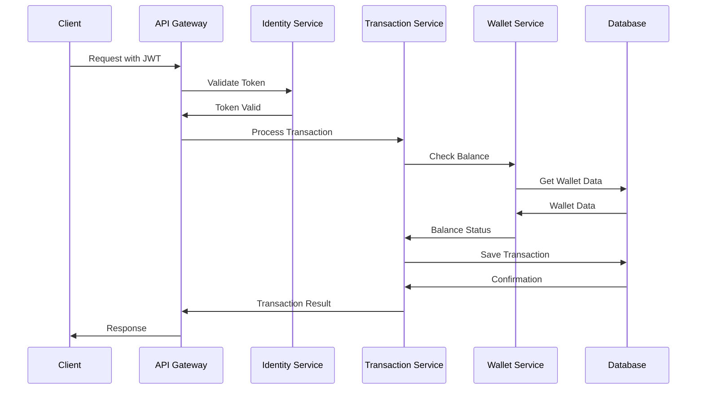
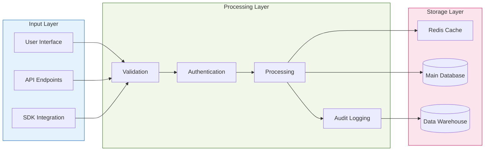
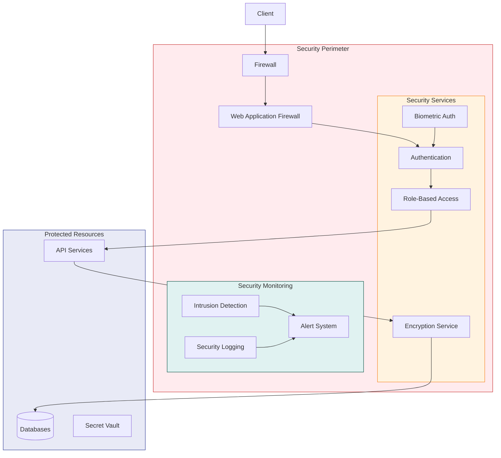
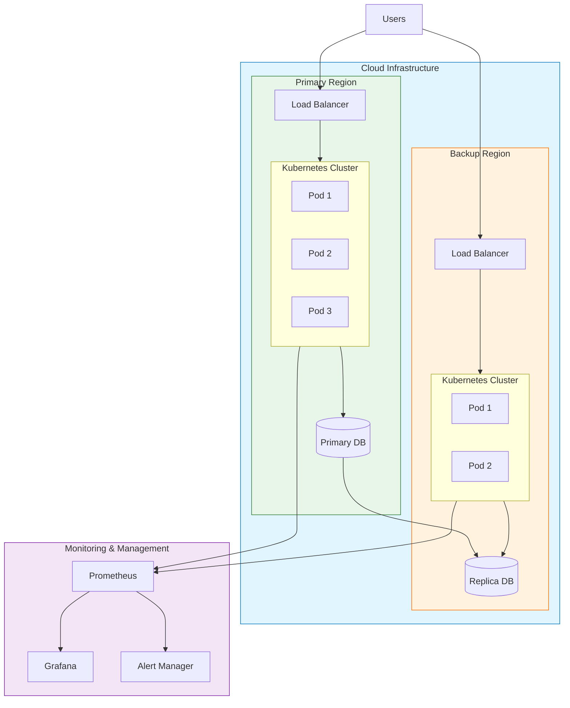
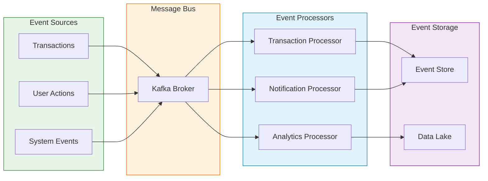

# System Architecture Overview

## High-Level Architecture

## Service Communication Flow

## Data Flow Architecture

## Security Architecture

## Deployment Architecture

## Event Flow Architecture

