# Service Experience and System Visuals

This document illustrates how AfriPay's channels surface capabilities to end users and how each channel maps to the backend landscape. It focuses on the experience for the three primary personas:

- **Superuser** – A privileged operator who can reach every administrative surface and manage global policy.
- **Administrator** – Operations staff with scoped permissions that are granted and revoked by the superuser.
- **Agent** – Field personnel who interact with customers and have the narrowest set of privileges.

The diagrams combine user-facing flows (front-end) with the corresponding service components (back-end). All restricted paths explicitly show the superuser's ultimate control over administrator access.

## Role Control Overview

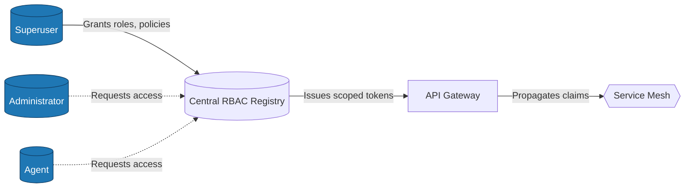

The superuser alone can promote or demote other users. Administrators and agents operate strictly within scopes assigned in the RBAC registry.

---

## Web Portal Service (Front End)

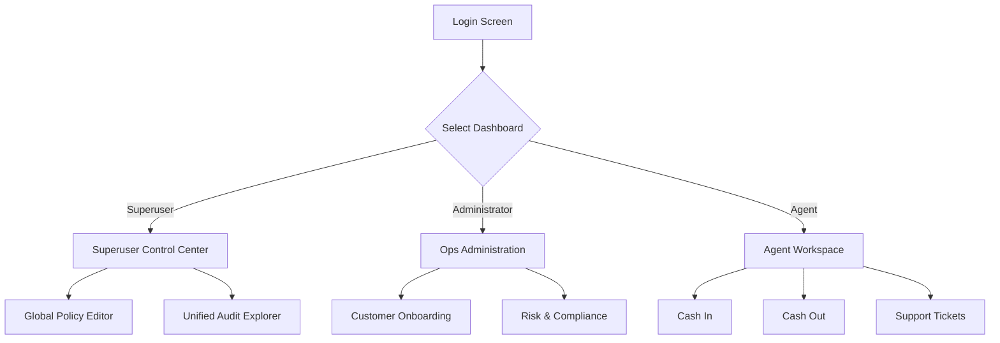

### Web Portal Backend Mapping

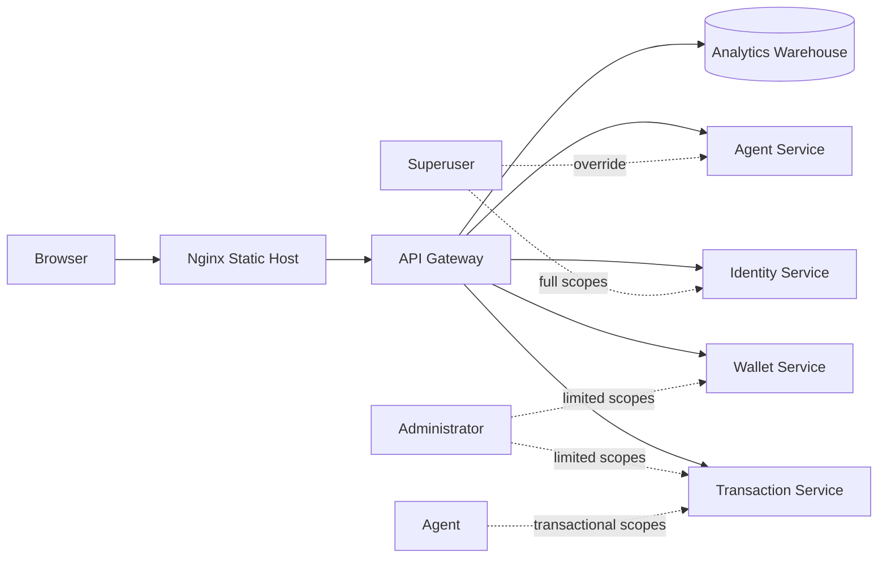

The front-end screens are filtered by the access token claims supplied by the identity service. Superusers see every dashboard, while administrators and agents see only tiles enabled for their scopes.

---

## Identity Service

### Front-End Touchpoints

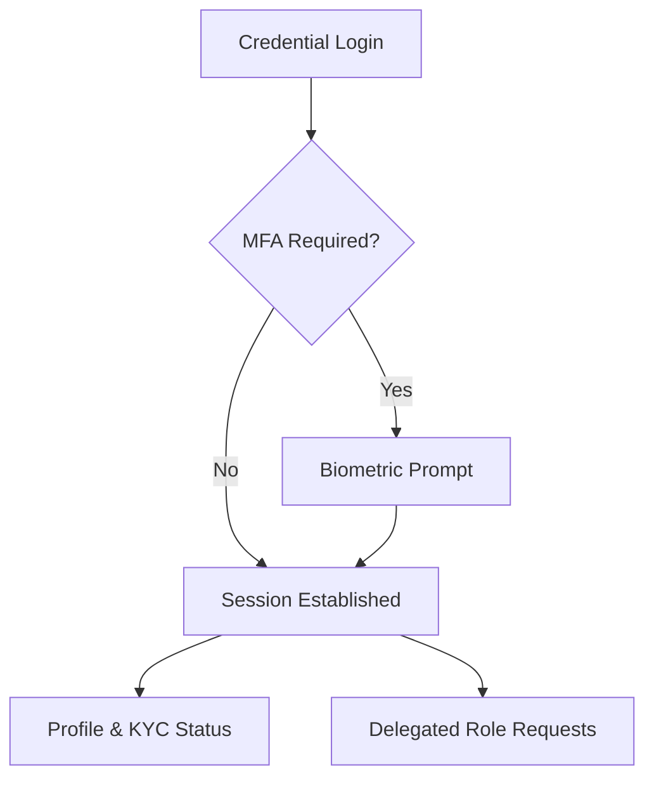

### Back-End Components

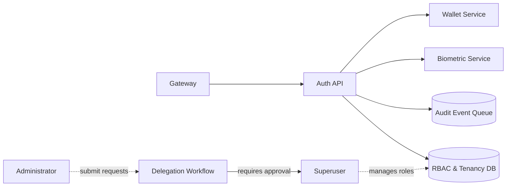

The superuser approves all delegation workflows before new roles activate.

---

## Agent Service

### Front-End Touchpoints

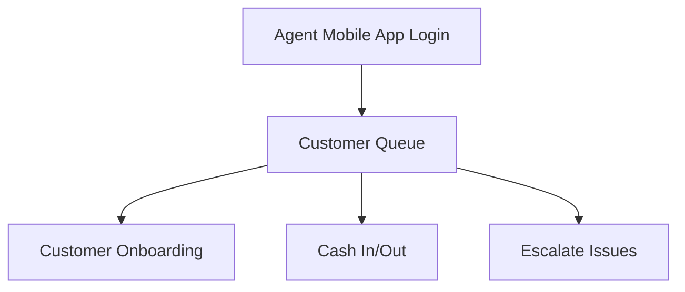

### Back-End Components

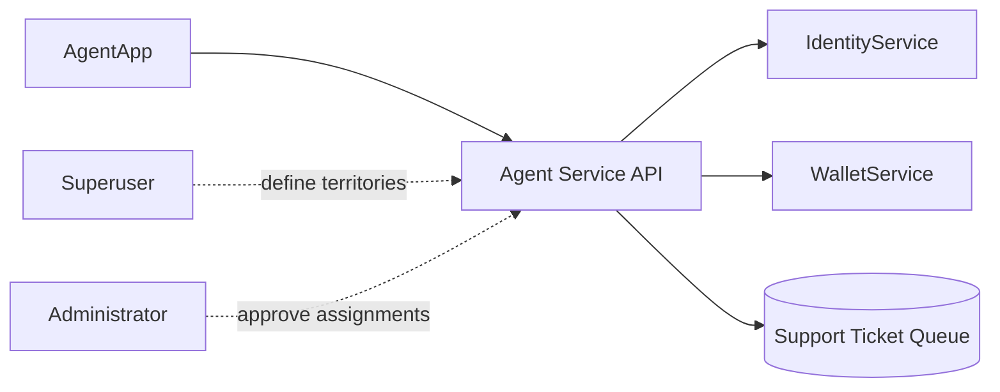

Superusers can override administrator territory rules and revoke agent access instantly.

---

## Transaction Service

### Front-End Touchpoints

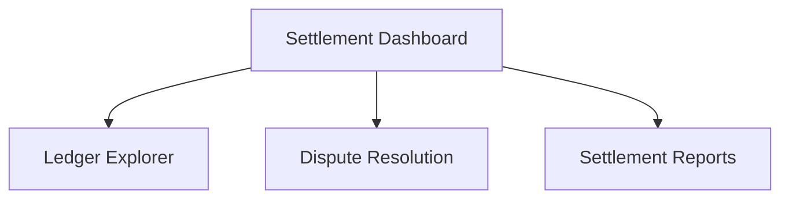

### Back-End Components

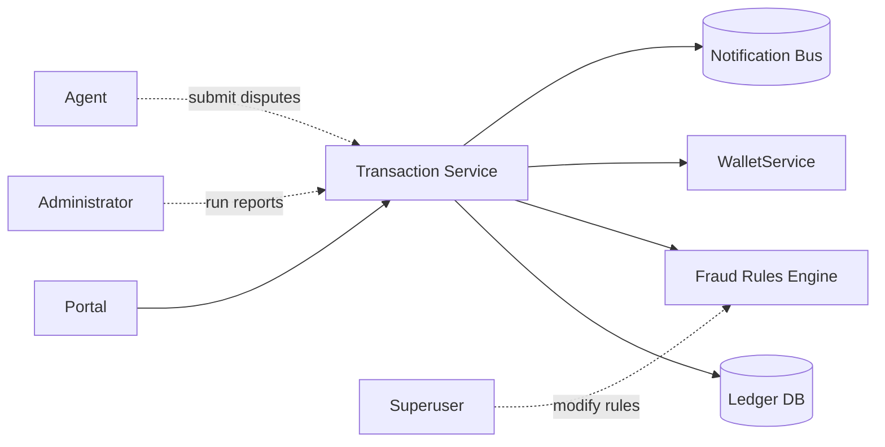

---

## Wallet Service

### Front-End Touchpoints

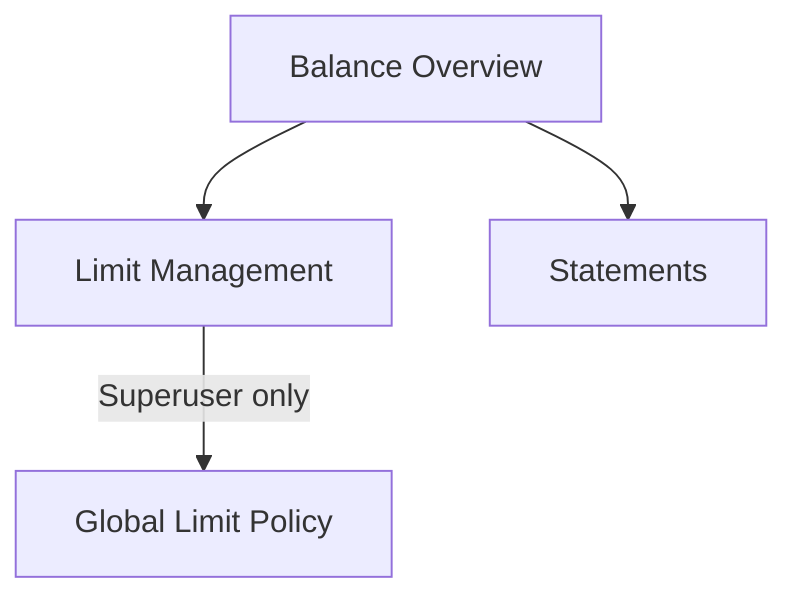

### Back-End Components

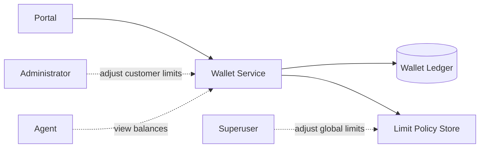

---

## Biometric Service

### Front-End Touchpoints

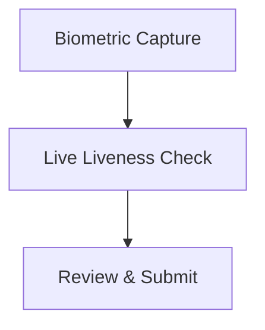

### Back-End Components

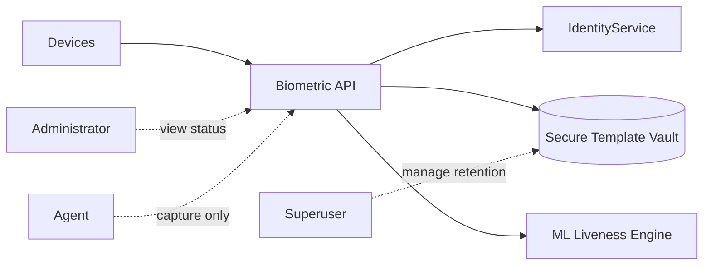

---

## USSD Service

### Front-End Touchpoints

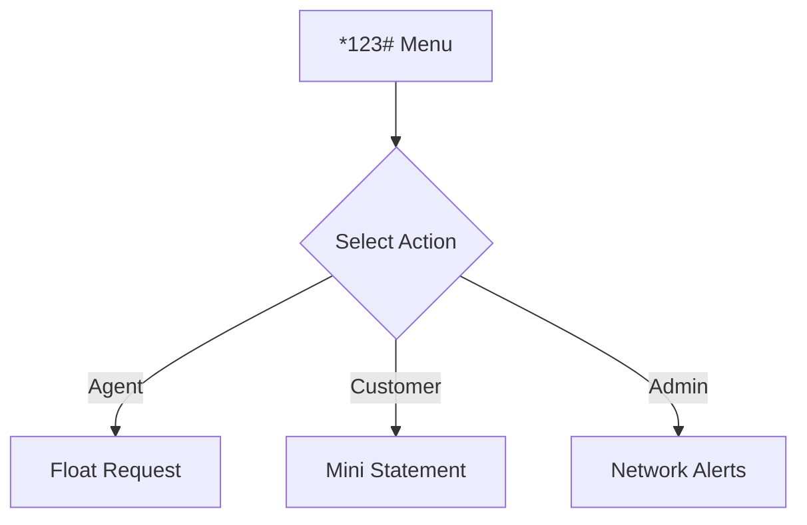

### Back-End Components

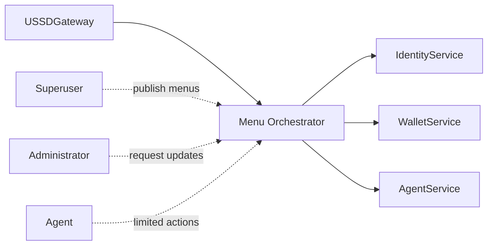

---

## Access Control Summary

| Persona | Typical Surfaces | Maximum Scope |
| --- | --- | --- |
| Superuser | All dashboards, policy editors, configuration consoles | Full platform control, can delegate or revoke any permission |
| Administrator | Operational dashboards, onboarding tools, reporting | Bound to business domains authorized by the superuser |
| Agent | Field tools (cash operations, USSD, ticketing) | Limited to transactions and tasks assigned to their branch |

All administrator and agent tokens are derived from superuser-approved scopes, ensuring centralized governance.
